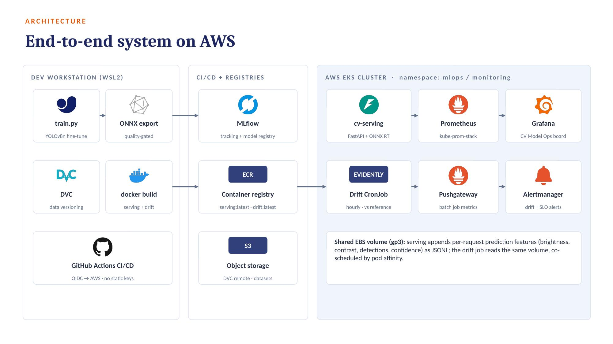

# mlops-cv-pipeline

[](https://github.com/nepseli/mlops-cv-pipeline/actions/workflows/ci.yaml)
[](LICENSE)
[](https://www.python.org/)
[](https://aws.amazon.com/eks/)

**A complete MLOps loop for computer vision — trained, deployed, monitored, and drift-alerted on real AWS infrastructure in half a day.**

Most MLOps tutorials stop at "the model is served." This one runs the whole loop on a live EKS cluster and then *proves the last stage works*: corrupted images are fed to the deployed endpoint, drift is detected statistically, and alerts fire — without anyone watching a dashboard.



---

## What it does

| Stage | Implementation |
|---|---|
| **Develop** | Fine-tune pretrained YOLOv8n (transfer learning) — `training/train.py` |
| **Verify** | Hard mAP@50 gate; below threshold the run exits non-zero and nothing registers |
| **Register** | MLflow tracking + Model Registry; `candidate` → `production` aliases as the deployment contract; DVC for dataset versioning |
| **Deploy** | ONNX Runtime behind FastAPI, containerized, pushed to ECR, rolled out on EKS |
| **Monitor** | kube-prometheus-stack; custom model metrics (latency, per-class detections, confidence histograms) on a provisioned Grafana dashboard |
| **Maintain** | Hourly Evidently CronJob compares live traffic to a reference window → Pushgateway → Prometheus → Alertmanager |

**Verified end to end.** Fine-tuned model reached **mAP@50 0.703**; deployed endpoint served at **185 ms median** on CPU pods; injecting darkened + blurred images drove **drift share to 0.80** and fired both `DataDriftDetected` and `DriftShareHigh`.

---

## Stack

`Python` · `PyTorch` / `Ultralytics YOLOv8` · `ONNX Runtime` · `FastAPI` · `MLflow` · `DVC` · `Docker` · `AWS EKS / ECR / S3 / EBS` · `Helm` · `Prometheus` · `Grafana` · `Alertmanager` · `Evidently` · `GitHub Actions`

### Buy vs make

Deliberate split — buy the undifferentiated layers, build the ones worth being able to debug.

| Bought | Built |
|---|---|
| Pretrained YOLOv8n weights | Fine-tuning + quality gate |
| Managed infra (EKS, ECR, S3, EBS) | Serving API and its instrumentation |
| GitHub Actions runners | Drift detection and alerting logic |

The drift detector only exists because the serving layer logs its own input and prediction features — that is the payoff for building rather than buying that layer.

---

## Quickstart

**Prerequisites:** an AWS account, plus `aws` (configured), `eksctl`, `kubectl`, `helm`, `docker`, and Python 3.11+. On Windows, run everything inside WSL2.

> **Cost warning.** This creates real AWS resources: roughly **$0.35–0.50/hour** (EKS control plane + 2× t3.large + EBS). A full session costs a few dollars. **`make destroy` when you are done.**

```bash
git clone https://github.com/nepseli/mlops-cv-pipeline.git
cd mlops-cv-pipeline

make cluster                          # ~20 min, unattended — start it first
./infra/bootstrap-aws.sh <ACCOUNT_ID> # creates ECR repos + S3 buckets
cp .env.example .env && $EDITOR .env  # paste the values the script printed

make deploy-core                      # gp3 StorageClass, namespace, MLflow
make mlflow-tunnel                    # separate terminal; leave running

python -m venv .venv && source .venv/bin/activate
pip install -r training/requirements.txt
make train                            # fine-tune → gate → ONNX → register v1

make fetch-model build push           # package the registered model
make monitoring                       # Prometheus + Grafana + Pushgateway (BEFORE deploy)
make deploy                           # serving, drift CronJob, alerts, dashboard

curl -sLo test.jpg https://ultralytics.com/images/bus.jpg
make smoke-test IMG=test.jpg          # detections JSON from your cluster

make destroy                          # tear it down
```

`make help` lists every target.

### See drift detection actually work

```bash
# 1. Establish "normal": send ~30 clean images, then baseline
for i in $(seq 1 30); do curl -s -o /dev/null -X POST -F "file=@test.jpg" http://localhost:8080/predict; done
make drift-run                        # first run bootstraps the reference window

# 2. Break the distribution: darken and blur the same image
python -c "from PIL import Image, ImageEnhance, ImageFilter; \
i=Image.open('test.jpg'); i=ImageEnhance.Brightness(i).enhance(0.25); \
i.filter(ImageFilter.GaussianBlur(4)).save('drift.jpg')"
for i in $(seq 1 30); do curl -s -o /dev/null -X POST -F "file=@drift.jpg" http://localhost:8080/predict; done

# 3. Detect it
make drift-run                        # drift_share climbs, alerts fire
```

Watch it land in Grafana (`kubectl -n monitoring port-forward svc/monitoring-grafana 3000:80`) and Alertmanager (`svc/monitoring-kube-prometheus-alertmanager 9093:9093`).

---

## Configuration and secrets

Account-specific values live in `.env`, which is gitignored. Tracked manifests keep `${ECR}` style placeholders; `make render` resolves them into `build/` (also gitignored) at apply time. **No tracked file is ever rewritten with your account values**, so there is nothing to accidentally commit. The Grafana admin password is injected into Helm from `.env` rather than stored in the values file.

Other measures worth naming explicitly:

- **Keyless CI.** `deploy.yaml` authenticates to AWS through GitHub's OIDC provider — short-lived credentials, no access keys stored anywhere. It stays dormant unless the repository variable `DEPLOY_ENABLED` is `true`, so a fork never fails on missing secrets.
- **Secret scanning in CI.** Every push runs gitleaks over the full history, so a leaked credential fails the build rather than sitting in a commit.
- **Non-root containers.** Both images run as UID 10001; pods set `runAsNonRoot`, drop all Linux capabilities, and disable privilege escalation.
- **Build-context isolation.** `.dockerignore` keeps `.env`, rendered manifests, and git history out of the Docker build context entirely.
- **Automated dependency updates.** Dependabot watches Actions, pip requirements, and base images.

To enable deployment from CI: set the `AWS_GHA_ROLE_ARN` secret (a role whose trust policy accepts tokens from this repo), the `AWS_REGION` and `EKS_CLUSTER` variables, and `DEPLOY_ENABLED=true`.

---

## What this deliberately is not

Being explicit about scope is more useful than pretending completeness:

- **Single serving replica.** Prediction logs use a ReadWriteOnce EBS volume shared with the drift job. Scaling out means moving those logs to S3 or EFS first.
- **MLflow on SQLite, reachable via port-forward.** Right-sized for one engineer; a team needs RDS Postgres, S3 artifacts via IRSA, and an ingress.
- **No canary deploys.** Promotion is an alias change plus a rollout. Argo Rollouts or KServe would add traffic-splitting.
- **A small demo dataset.** `coco128` (128 images) makes the gate real but weak — see below.
- **Retraining is human-triggered.** The alert → retrain webhook is intentionally the last automation to add, after the gate has earned trust.

### An honest finding

The fine-tuned model passed its gate at mAP 0.703 and then confidently labeled a bus as an **"airplane"** (0.68) on the very first real image. Fine-tuning on 128 images had eroded classes the pretrained model knew — and a validation set that small couldn't catch it. **Automated gates are necessary but not sufficient**; pair them with slice-level evaluation and qualitative checks on real inputs. That failure is preserved here rather than airbrushed out, because it is the most transferable lesson in the project.

---

## Repository layout

```
infra/          eksctl cluster config, AWS bootstrap, gp3 StorageClass
training/       fine-tuning with quality gate, model fetch helper
serving/        FastAPI + ONNX Runtime app, Dockerfile
monitoring/     Helm values, Grafana dashboard, Evidently drift job
k8s/            manifests (${VAR} placeholders, rendered by make)
.github/        CI/CD and on-demand retraining workflows
docs/           slide deck and architecture diagram
```

## Documentation

- **[TROUBLESHOOTING.md](TROUBLESHOOTING.md)** — every failure hit while building this, with root cause and fix. Read it before you debug your own.
- **[docs/MLOps_CV_Pipeline_Deck.pptx](docs/MLOps_CV_Pipeline_Deck.pptx)** — 25-slide technical walkthrough: architecture, tool trade-offs with merits, per-stage detail, results, and lessons.

## Roadmap

1. IRSA so pods get scoped AWS identities (S3-backed MLflow artifacts)
2. Prediction logs → S3, then horizontal scaling with an HPA
3. RDS-backed MLflow + ingress so CI can reach the registry
4. Canary rollouts (Argo Rollouts / KServe)
5. Retrain on *drifted* data, not just a re-run of the same set
6. Sliced evaluation sets that would have caught the airplane/bus failure

## License

MIT — see [LICENSE](LICENSE).
